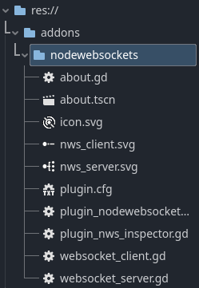
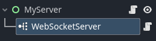
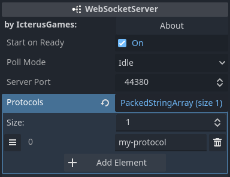
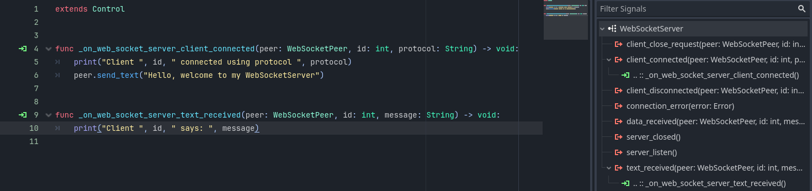
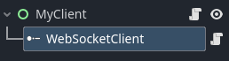
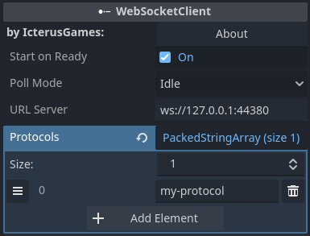
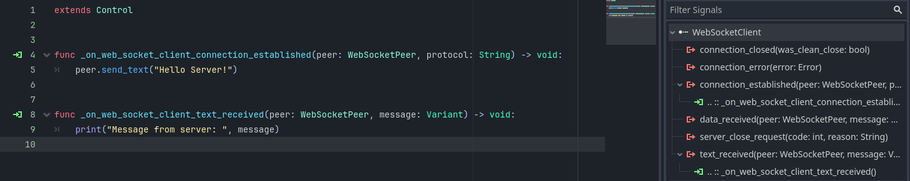

#  NodeWebSockets

A plugin for Godot 4. It gives you two new nodes, a WebSocketServer and a WebSocketClient.

## How to install

### Using the AssetLib on Godot
* Open the AssetLib tab on Godot and search "NodeWebSockets"
* Install the NodeWebSockets plugin
* Enable NodeWebSockets in `Project -> Project Settings -> Plugins`

### Manual installation
* Clone or download this repository
* Copy the folder 'addons/nodewebsockets' in your 'res://addons/' folder
  - 
* Enable SimpleGrassTextured in `Project -> Project Settings -> Plugins`

### Upgrade from previous version
* Close all your scenes
  > Especially those in which there is some NodeWebSockets
* Disable NodeWebSockets in `Project -> Project Settings -> Plugins`
* Delete the folder 'addons/nodewebsockets' on your project
* Install the new NodeWebSockets version
* Enable NodeWebSockets in `Project -> Project Settings -> Plugins`
* Reload Godot

## How to create a basic server
* Add a WebSocketServer node to your scene
  - 
* Configure your server in the inspector, indicating at least a connection port and protocol (clients must connect using the same protocol, if no protocol is indicated, clients must not specify any protocol either)
  - 
* Connect the server signals you need, for example "client_connected" and "text_received"
  - 

## How to create a basic client
* Add a WebSocketClient node to your scene
  - 
* Configure your client in the inspector, indicating the URL and port of the server with the following format ws://IP-ADDRESS:PORT, and the protocols to use (the server will select one of the protocols, if none is available on the server the connection will be closed)
  - 
* Connect the client signals you need
  - 
